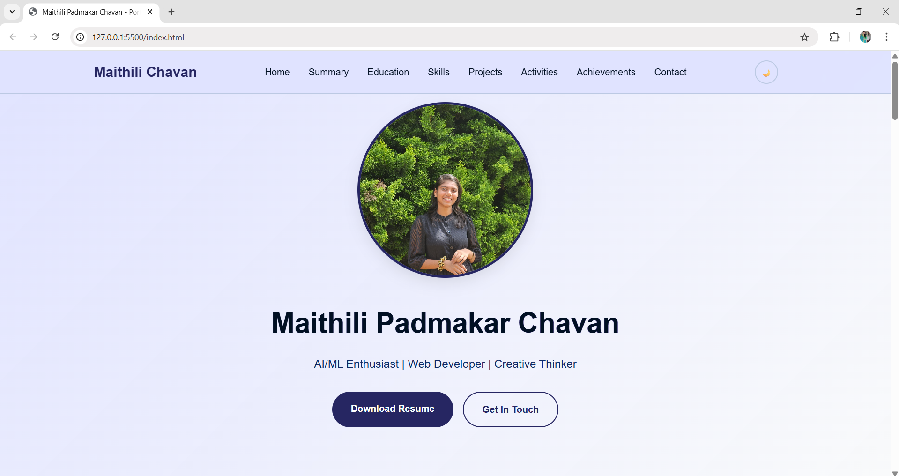
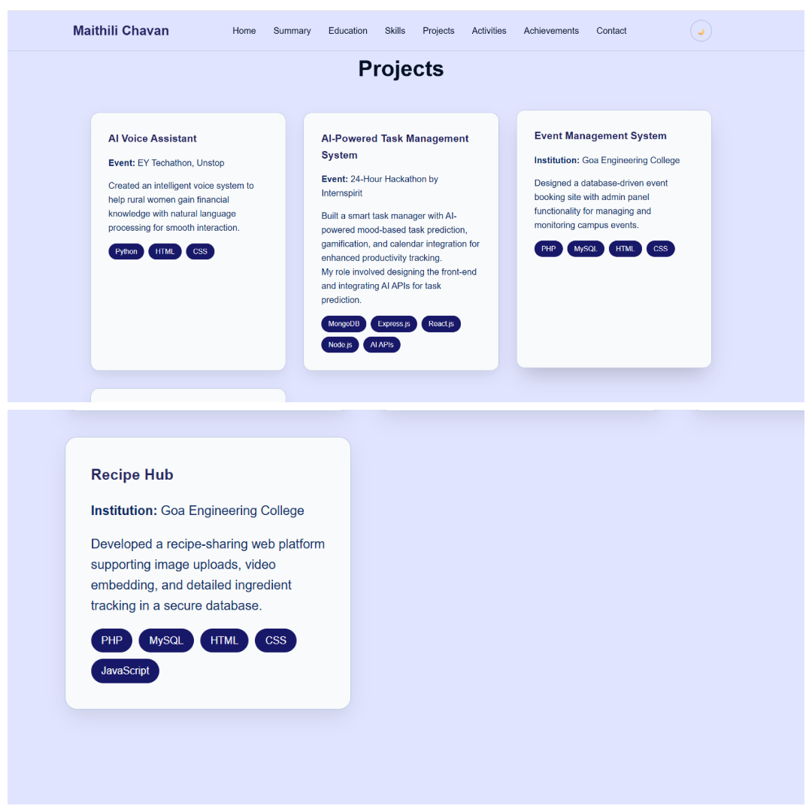
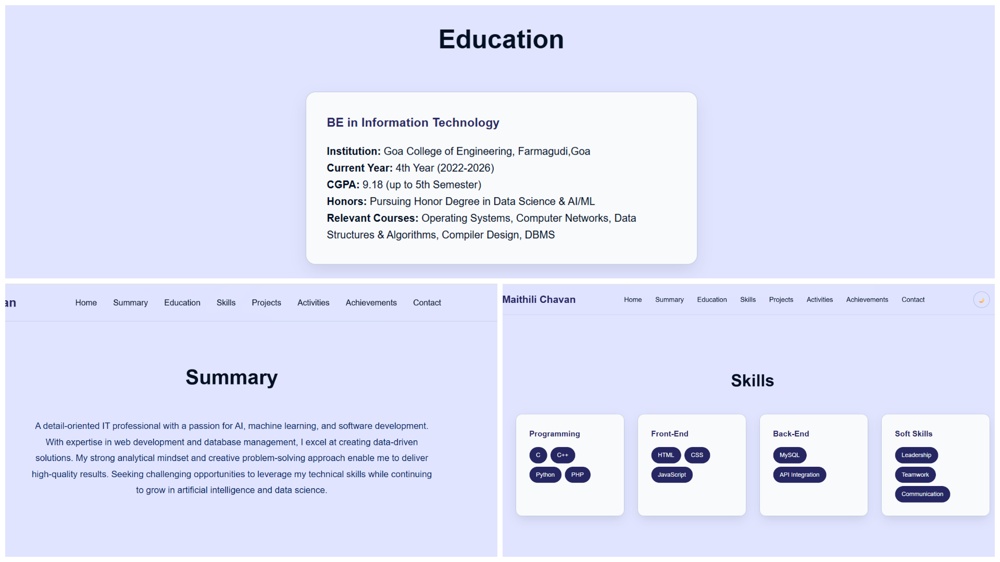
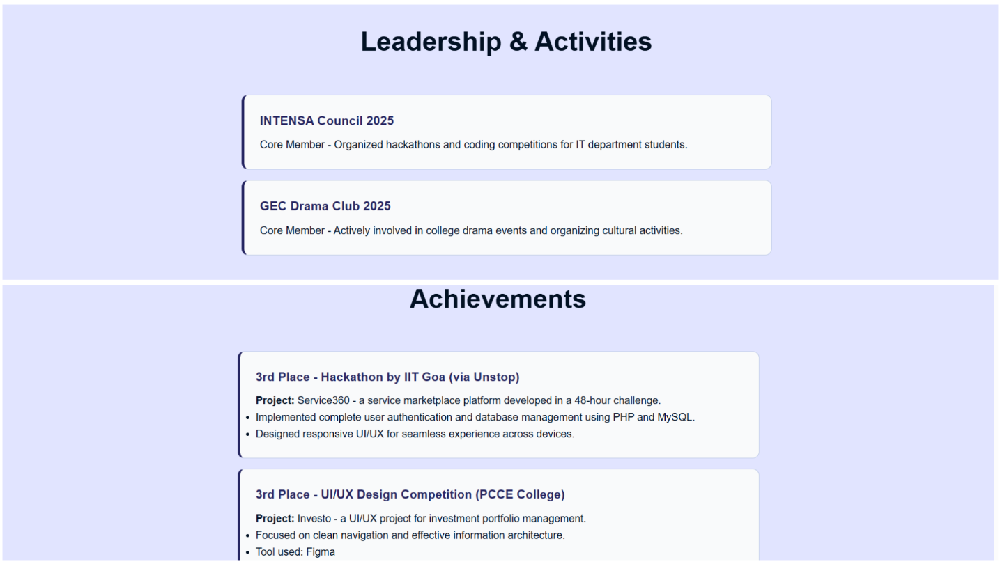
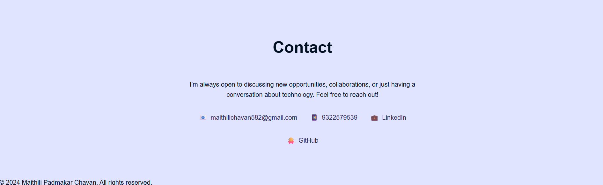
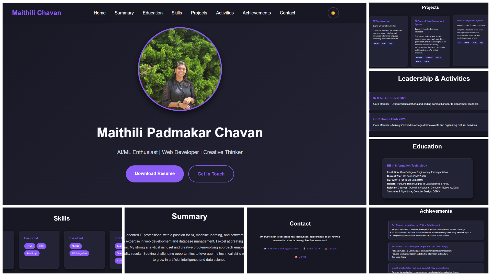

# 🌐 Personal Portfolio Website

This is my personal portfolio website built using **HTML**, **CSS**, and **JavaScript**.  
It highlights my skills, education, and projects in a clean and responsive layout.

## ✨ Features

- Responsive design for all screen sizes
- Dark and light mode toggle using JavaScript
- Project showcase and personal details section
- Smooth scrolling and interactive elements

## 💻 Technologies Used

- HTML5
- CSS3
- JavaScript 

## 🚀 Deployment

This portfolio is deployed using **GitHub Pages** and can be viewed live at:  
👉 

## 📁 Folder Structure

portfolioweb/
├── index.html
├── style.css
├── script.js
├── README.md
├── websitepics
├── resume.pdf
├── mypic.jpg

## 🖼️ Screenshots

### 🔹 Home Page

### 🔹 Projects Section

### 🔹 Summary,Education and Skills Section

### 🔹 Activities and Achievements Section

### 🔹 Contact Section

### 🔹 Dark Mode Enabled

